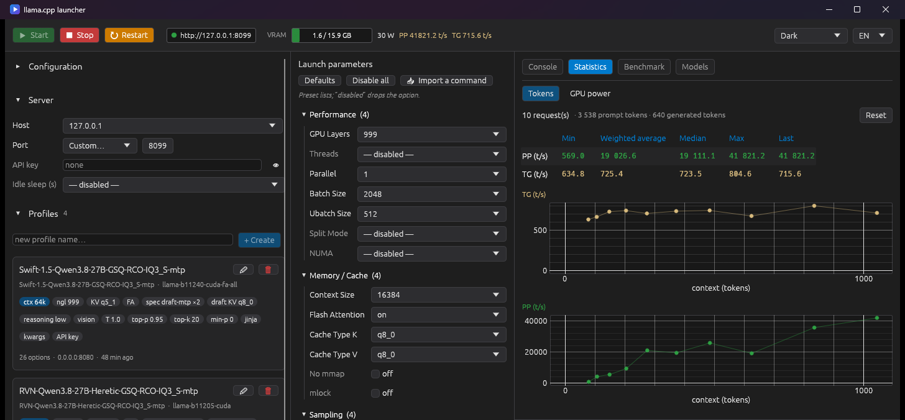

# llama.cpp launcher

**A single-file Windows app to run, tune and benchmark [llama.cpp](https://github.com/ggml-org/llama.cpp) — without ever typing a command-line flag.**

[](https://github.com/vv7r/llama-cpp-launcher/releases/latest)


[](LICENSE)



*[Version française](README.fr.md)*

---

## Why

`llama-server` has dozens of options, and a single typo — `--cache-type-k q8`
instead of `q8_0`, a value your build doesn't support — stops the server from
starting. This launcher puts every option behind a **closed list of valid
values**: you pick, you never type. "Disabled" simply removes the option from
the command line.

It also ships as **one `.exe` with no runtime**: no .NET, no WebView, no Visual
C++ redistributable (the CRT is linked statically). Download it, run it.

It is a Rust rewrite of [llamapilot](https://github.com/Hamrounmh/llamapilot)
(WPF / .NET 8), extended with llama.cpp installation and updates, Hugging Face
downloads, live statistics and GPU power tracking.

## Contents

- [Features](#features)
- [Getting started](#getting-started)
- [Using the app](#using-the-app)
- [Where your data lives](#where-your-data-lives)
- [Building from source](#building-from-source)
- [Project layout](#project-layout)
- [Credits and license](#credits-and-license)

## Features

**Launch llama-server**
- 35 options in 7 groups (performance, memory/cache, sampling, speculative
  decoding, template, multimodal, server), each with a tooltip explaining what
  it does. Names, aliases and values are checked against real
  `llama-server --help` output.
- The exact command is shown live, one option per line, ready to paste in a
  terminal or copy as a single line.
- Start / Stop / Restart, colored console with auto-scroll, server status
  and live prompt/generation speeds in the top bar.
- **Import an existing command**: paste any `llama-server` command line. Aliases
  (`-c`, `-fa`, `-ngl`…), `--opt=value`, negative flags (`--no-jinja`) and
  cmd / PowerShell / bash line continuations are understood. Nothing is lost:
  an unknown value is added to the option's list, an unknown option is kept
  and passed through as-is.
- API key is the only typed value, in a masked field; it is masked in the
  console too.

**Profiles**
- Save settings as profiles shown like a chat list, with tags summarising the
  key choices (context size, KV cache, flash attention, speculative decoding,
  reasoning effort, vision…), rename, update or delete.

**Install and update llama.cpp from source**
- No llama.cpp yet? The app clones and builds it for your machine (CUDA,
  Vulkan or CPU), checking prerequisites (Git, CMake, Visual Studio Build
  Tools, CUDA Toolkit / Vulkan SDK) and showing the `winget` command for any
  missing tool.
- Updates build incrementally and publish a **new release folder** each time
  (`llama-b11235-cuda`): a running server is never overwritten, and older
  versions stay available for comparison. Deleting one is an explicit choice.
- Optional **FlashAttention for every KV cache type**
  (`GGML_CUDA_FA_QUANTS=all`): by default llama.cpp only compiles the CUDA
  kernels for f16-f16, q4_0-q4_0, q8_0-q8_0 and bf16-bf16. The cache-type lists
  flag with ⚠ any K/V pair the selected build does not support.

**Models**
- Recursive scan of your models folder; split models are grouped, `mmproj`
  vision projectors are offered separately.
- GGUF header reading (architecture, max context, layers, chat template) in the
  background, cached between sessions — instant even on 40 GB files.
- **Hugging Face downloads**: browse trending or most-downloaded GGUF
  repositories (text and vision models only), pick the exact file (quant,
  variant, size) and download it. Interrupted downloads **resume** where they
  stopped.

**Statistics**
- Per-request prompt (PP) and generation (TG) speeds read from the server
  logs: min, **token-weighted average**, median, max, last, draft acceptance
  rate, and charts of speed versus context size (hover a point for the prompt
  size).
- **GPU power** (NVIDIA): live wattage curve, energy used since the server
  started (with Wh per 1000 generated tokens), since the app opened and in a
  running total — and its cost at your electricity price.

**Benchmark**
- Runs `llama-bench` on the models and versions you tick, with editable
  settings (GPU layers, KV cache, flash attention, prompt / generation tokens,
  **context depth**, repetitions). Results are kept in `benchmark.md` with the
  settings of each measurement; "missing only" skips what is already measured.

**Everything else**
- VRAM gauge and GPU power in the top bar (NVIDIA, via `nvidia-smi`).
- Six themes: Dark, Light, Nord, Dracula, Gruvbox, Solarized Light.
- English and French; follows the Windows language on first launch.
- The UI renders on the integrated GPU when there is one, leaving the whole
  VRAM of the dedicated card to your models.

## Getting started

### Requirements

- Windows 10 or 11, 64-bit.
- Optional: an NVIDIA GPU for the VRAM gauge and power tracking.
- Only to build llama.cpp from source: Git, CMake, Visual Studio Build Tools and,
  for GPU builds, the CUDA Toolkit or the Vulkan SDK. The app tells you what is
  missing.

### Install

1. Download **`llama-cpp-launcher.exe`** from the
   [latest release](https://github.com/vv7r/llama-cpp-launcher/releases/latest).
2. Put it in a folder of its own (it stores its settings next to itself), for
   example `C:\llama\launcher\`.
3. Run it. The executable is not code-signed, so Windows SmartScreen may warn
   you the first time: click *More info* → *Run anyway*.

### First launch

- **You already have llama.cpp**: pick the **llama.cpp directory** — the folder
  that contains your builds, each subfolder holding a `llama-server.exe`
  (`bin/` and `build/bin/` are found too).
- **You don't**: the app opens on **Install llama.cpp**. Choose a short folder
  such as `C:\llama` (Windows limits path length and the build goes deep),
  a backend, then **Download and build**. A CUDA build takes 20 to 60 minutes.

Then pick your **models directory** (scanned recursively for `.gguf` files),
or download a model from the **Models** tab.

## Using the app

1. **Left column** — llama.cpp version, GGUF model, optional vision model,
   host and port, profiles.
2. **Middle column** — launch parameters by group. *Defaults* restores the
   defaults, *Disable all* starts from a bare command, *Import a command*
   reads an existing one.
3. **Top bar** — *Start*. The status turns into the server address: open it in
   a browser for the llama.cpp web UI, or point any OpenAI-compatible client at
   it.
4. **Tabs** — *Console* (live output), *Statistics*, *Benchmark*, *Models*.

Every label, list and button has a tooltip; a disabled button explains why it
is disabled.

**Updating llama.cpp**: *⚙ Options → Update llama.cpp…* checks for new commits,
builds them and selects the new release. Build options are taken from your
existing build (`CMakeCache.txt`), and the build happens in a dedicated
`build-uillamacpp` folder — your own `build` folder is never touched.

## Where your data lives

Everything is stored next to the executable, so the app stays portable:

| File | Content |
|---|---|
| `config.json` | folders, selections, parameters, theme, language, energy total |
| `profiles/*.json` | saved profiles |
| `benchmark.md` | benchmark results, as a Markdown table |
| `gguf-cache.json` | cached GGUF headers |

If `config.json` ever becomes unreadable, it is backed up to `config.json.bak`
instead of being overwritten.

## Building from source

Requires [Rust](https://rustup.rs) 1.95 or newer with the MSVC toolchain
(Visual Studio Build Tools).

```bash
git clone https://github.com/vv7r/llama-cpp-launcher.git
cd llama-cpp-launcher
cargo test
cargo build --release
# -> target/release/uillamacpp.exe
```

To build the executable that gets published, use the release script instead:

```powershell
powershell -ExecutionPolicy Bypass -File scripts\build-release.ps1
# -> dist\llama-cpp-launcher.exe
```

It strips local paths from the binary (Rust embeds the source path of every
dependency, e.g. `C:\Users\<you>\.cargo\registry\…`) with
`--remap-path-prefix`, then checks that none is left.

`.cargo/config.toml` links the C runtime statically, and `build.rs` embeds the
icon (drawn by `src/icon.rs`) into the executable.

After updating llama.cpp, check that the option catalog still matches what
`llama-server` accepts:

```bash
llama-server --help > help.txt
LLAMA_SERVER_HELP=help.txt cargo test catalog_matches -- --ignored
```

## Project layout

```
src/
├── main.rs        entry point, window, GPU selection for rendering
├── app.rs         application state and UI (panels, tabs, dialogs)
├── params.rs      option catalog and the value lists of each option
├── cmdparse.rs    command-line import
├── config.rs      config.json
├── profiles.rs    profiles/*.json
├── discovery.rs   llama.cpp versions and GGUF models on disk
├── gguf.rs        GGUF header reader
├── process.rs     llama-server process and its output
├── stats.rs       per-request statistics from the server logs
├── power.rs       GPU power curve, energy and cost
├── gpu.rs         VRAM and power through nvidia-smi
├── bench.rs       llama-bench and benchmark.md
├── hub.rs         Hugging Face listing and resumable downloads
├── updater.rs     llama.cpp install, update and release management
├── fattn.rs       FlashAttention K/V pairs compiled in a CUDA build
├── icon.rs        application icon (window and .exe)
└── theme.rs       themes and colored action buttons
```

The UI never mutates state while drawing: interactions produce `Action`s
applied after the frame. Child processes are read by dedicated threads that
push their lines into channels and wake the UI.

## Credits and license

- [llama.cpp](https://github.com/ggml-org/llama.cpp) by Georgi Gerganov and
  contributors — this app only drives its `llama-server` and `llama-bench`.
- [llamapilot](https://github.com/Hamrounmh/llamapilot), the original WPF
  launcher this project started from.
- Built with [egui / eframe](https://github.com/emilk/egui).

Released under the [MIT license](LICENSE).
